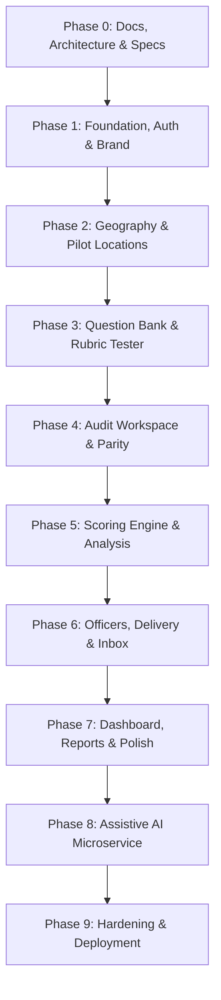

# Project Roadmap — Abhisaran Audit & ACS Platform

---

## Phase Breakdown & Phase Gates

### Phase 0: System Architecture, Data Model & Specifications
- **Objective**: Ingest reference materials and produce comprehensive engineering specifications before writing codebase implementations.
- **Deliverables**:
  - `docs/ARCHITECTURE.md`: Monorepo structure, component boundaries, security model, and data isolation.
  - `docs/DATA_MODEL.md` (with Mermaid ERD): Normalized tables, foreign keys, JSONB fields, indexes, and constraints.
  - `docs/SCORING_SPEC.md`: Deterministic mathematical scoring logic, 7 rubric evaluators, weighting, deduction ledger, coverage, and alert spectrum.
  - `docs/UI_PARITY_CHECKLIST.md`: Itemized comparison matrix against `ahfjhabsd/abhisaran-field-form-preview.html`.
  - `docs/API_SPEC.md`: REST endpoints (`/api/v1`), request/response schemas, and role permissions.
  - `docs/DECISIONS.md`: Initial implementation decisions log.
- **Phase Gate**: **Owner Review & Approval**. No implementation code written until signed off.

---

### Phase 1: Foundation, Core Infrastructure, Auth & Brand Motion
- **Objective**: Establish monorepo workspace, CI pipelines, initial database migrations, zero-backdoor authentication, and the branded convergence splash animation.
- **Deliverables**:
  - Monorepo layout (`apps/web`, `apps/api`, `apps/ai`, `shared/golden-vectors`).
  - PostgreSQL Flyway migration baseline (users, roles, sessions, audit_log, login_attempts).
  - Spring Security with Argon2id hashing, rate limiting (5 failures / 15 min), generic error messages, and first-admin env bootstrap (`BOOTSTRAP_ADMIN_ID`/`BOOTSTRAP_ADMIN_PASSWORD`).
  - SVG Logo Convergence Splash animation (~2.8s, 60fps, skipping on interaction) and reusable `<AbhisaranLoader />`.
  - Frontend login screen with segmented control `[ Government Officer | Admin ]`.
  - Health check & cold-start handling (`GET /health`).
- **Phase Gate**: Login verified for both roles against real Postgres; no backdoor credentials exist; splash animation demo running at 60fps.

---

### Phase 2: Geography Hierarchy & Pilot Location Management
- **Objective**: Implement master geographic datasets, location classification, and immutable code generation.
- **Deliverables**:
  - Seed migrations for States and Districts (LGD standard) with admin management endpoints.
  - Pilot location types (`SCHOOL`, `ANGANWADI`, `PHC`, `HOSPITAL`, `OTHER`) mapped to domains.
  - Immutable code generator producing `{PREFIX}-{STATE2}-{DIST3}-{SEQ4}`.
  - Restricted registry table (`pilot_location_registry`) with audit-logged access.
  - Admin Home navigation shell.
- **Phase Gate**: Creation of pilot locations across types with non-recyclable codes; verified zero leakage of names to public APIs.

---

### Phase 3: Master Question Bank & Rubric Builder
- **Objective**: Import master question bank from `question_merge_map.csv`, establish immutable version snapshots, and build the interactive question builder.
- **Deliverables**:
  - Importer script/migration for `question_merge_map.csv` (72 questions + 4 registry fields).
  - Versioned question schema (`question_bank`, `question_versions`) with JSONB fields and rubrics.
  - Question Builder UI supporting all 11 field types, evidence toggles, and alert overrides.
  - Server-backed live rubric tester (`POST /questions/:id/test-rubric`).
  - Rubric Review administrative screen for `DEFAULT_PENDING_OWNER_REVIEW` questions.
- **Phase Gate**: 100% of seed questions accurately loaded; version snapshotting proven across mutations; rubric tester matches scoring expectations.

---

### Phase 4: Field Audit Workspace & UI Parity
- **Objective**: Replicate the reference field audit experience with multi-page handling, offline autosave, and per-question evidence attachments.
- **Deliverables**:
  - Exact responsive layout matching `ahfjhabsd` (sticky 56px header, tabs strip, section navigation, progress strip, footer controls).
  - Multi-page lifecycle per location: Add, Duplicate (answers only), Clear, Delete (DRAFT only).
  - IndexedDB offline-tolerant autosave with explicit "Saved on device" vs "Synced" state.
  - Per-question evidence upload: JPG/PNG/WEBP/PDF ≤ 10 MB, magic bytes verification, EXIF stripping, privacy attestation checkbox.
  - Submission validation: prevents submission if scored questions are unassessed without reasons; locks pages as `SUBMITTED`.
- **Phase Gate**: Side-by-side visual parity screenshots at 390px and 1280px; completed UI parity checklist; offline autosave demonstration.

---

### Phase 5: Deterministic Scoring Engine & Analysis View
- **Objective**: Implement pure Java `ScoringEngine`, golden test vectors, analysis execution, and the interactive decision-support details view.
- **Deliverables**:
  - Pure Java `ScoringEngine` implementing all 7 rubric evaluators, severity weighting, deduction ledger, coverage, and spectrum rules.
  - Comprehensive JUnit 5 test suite verifying golden vectors (`shared/golden-vectors/*.json`) and asserting `Σ lost_w / Σ max_w * 100 == 100 − ACS`.
  - Immutable `analysis_runs`, `analysis_items`, and `analysis_ledger` database persistence.
  - Shared Details View: ACS spectrum gauge, deduction waterfall, alert cards with evidence thumbnails, section breakdown, and rubric working steps.
- **Phase Gate**: 100% scoring test suite passes; deduction ledger strictly balances to `100 − ACS`; waterfall renders accurate breakdown.

---

### Phase 6: Officer Scoping, Automatic Delivery & Officer Portal
- **Objective**: Automate result delivery to officers within assigned districts and provide a tailored, read-only officer portal.
- **Deliverables**:
  - Government officer management: unique IDs, one-time temporary passwords, multi-district scoping.
  - Atomic transactional delivery: creation of `delivery` records upon analysis completion.
  - Historical delivery back-fill upon scope assignment.
  - Officer Portal: ACS Inbox with unread indicators, district filters, and read-only access to analysed results and authenticated evidence.
  - Strict security verification ensuring officers cannot view unassigned districts or registry names.
- **Phase Gate**: Multi-district delivery verified in single transaction; officer portal tested with strict isolation bounds.

---

### Phase 7: Administrative Dashboards, Reporting & System Polish
- **Objective**: Complete administrative overview tools, bulk analysis, printable PDF reports, and security audit log viewer.
- **Deliverables**:
  - Admin Overview table with status counts, multi-dimensional filters, and bulk analysis execution.
  - Strict non-ranking enforcement: default sorting by code, absence of leaderboards or rank columns.
  - Code-only PDF report generator for audit pages and analysed ACS summaries.
  - Append-only Audit Log viewer with filtering by actor, action, and timestamp.
  - Full accessibility audit (WCAG 2.1 AA) and responsive polish.
- **Phase Gate**: Bulk analysis execution verified; PDF export verified with zero location names; accessibility audit passed.

---

### Phase 8: Assistive AI Microservice (Python / FastAPI)
- **Objective**: Deploy assistive, isolated Python AI service for PII screening, OCR extraction, and draft summary generation.
- **Deliverables**:
  - FastAPI application (`apps/ai`) with internal token authentication (`AI_SERVICE_TOKEN`).
  - Endpoints: `/v1/pii-screen`, `/v1/extract-text`, `/v1/summarise-run`, `/v1/group-observations`.
  - Spring Boot proxy endpoints (`/api/v1/ai/*`) and `ai_drafts` persistence.
  - Admin UI for reviewing, accepting, and rejecting AI narrative drafts.
  - Architectural tests asserting AI service has zero database access and zero write capability to scoring tables.
- **Phase Gate**: Full core platform operational with `FEATURE_AI=false` and AI service disconnected; zero scoring impact from AI outputs.

---

### Phase 9: Hardening, Full Verification & Production Deployment
- **Objective**: Execute end-to-end integration tests, security audit, container optimization, and production readiness documentation.
- **Deliverables**:
  - Playwright end-to-end test suite (Splash → Login → Audit → Evidence → Submit → Analyse → Officer Inbox).
  - Production Dockerfiles for `api`, `web`, and `ai` with multi-stage builds.
  - `docker-compose.yml` for local development and `render.yaml` for production deployment.
  - Security hardening review (OWASP Top 10, ASVS Level 1 compliance).
  - Operational runbook and backup/restore documentation.
- **Phase Gate**: All Playwright E2E tests pass on PostgreSQL; production builds succeed; complete operational runbook verified.
