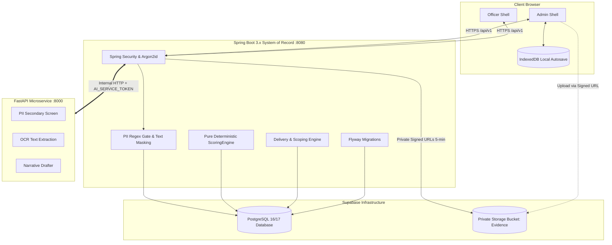
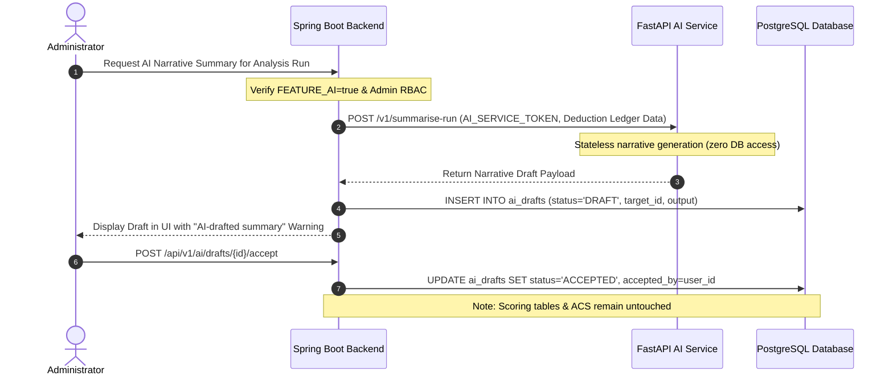

# System Architecture Document — Abhisaran Platform

## 1. Overview & System Topology

The **Abhisaran Audit & ACS Platform** is a multi-tier, zero-PII audit and decision-support system designed to monitor service continuity across public institutions (Schools, Anganwadis, Primary Health Centres, Hospitals).

### Monorepo Structure

```
Impact_Audit_prototype/
├── apps/
│   ├── web/                    # Frontend SPA (React 18+, TypeScript, Vite)
│   │   ├── src/
│   │   │   ├── components/     # Design system, loader, form cards, dialogs
│   │   │   ├── features/       # Auth, Audit Workspace, Dashboard, Officer Inbox
│   │   │   ├── services/       # API client, IndexedDB offline storage
│   │   │   └── tokens/         # CSS variables matching ahfjhabsd/src/styles.css
│   ├── api/                    # System of Record & Rule Authority (Java 21, Spring Boot 3.x)
│   │   └── src/main/java/org/abhisaran/
│   │       ├── auth/           # Spring Security, Argon2id, lockout, session management
│   │       ├── users/          # User entities, admin/officer profile management
│   │       ├── geography/      # States and Districts management (LGD standard)
│   │       ├── locations/      # Pilot locations, code generator, registry
│   │       ├── questions/      # Question bank, versioning, rubric models
│   │       ├── audit/          # Audit pages, answer snapshots, validations
│   │       ├── evidence/       # Magic-byte check, EXIF stripping, signed URL issuer
│   │       ├── scoring/        # Pure deterministic ScoringEngine
│   │       ├── analysis/       # Analysis runs, deduction ledger, alert generator
│   │       ├── delivery/       # District-scoped automated delivery to officers
│   │       ├── officers/       # Officer administration and scope assignment
│   │       ├── registry/       # Restricted location registry with audit trail
│   │       ├── auditlog/       # Append-only security and operational audit trail
│   │       ├── ai/             # Server-to-server AI client proxy
│   │       └── common/         # Error handlers, PII regex filters, constants
│   └── ai/                     # Assistive AI Microservice (Python 3.11, FastAPI)
│       ├── app/
│       │   ├── api/            # /v1/pii-screen, /v1/extract-text, /v1/summarise-run
│       │   ├── core/           # Security token validation, config
│       │   └── services/       # PII screening, OCR, narrative draft generators
│       └── tests/              # Isolation tests, verification of zero DB writes
├── shared/
│   └── golden-vectors/         # Cross-language canonical JSON scoring fixtures
├── docs/                       # Specifications, architecture, ER diagrams, APIs
├── ahfjhabsd/                  # Reference field UI prototype
└── question_merge_map.csv      # De-duplicated master question bank
```

---

## 2. Architectural Boundaries & Non-Negotiable Guarantees



### The 10 Core Architectural Constraints

1. **Zero Synthetic / Fake Data**: No mock numbers, fake statistics, or dummy cards in UI components. Empty states are explicitly rendered with structured empty-state views. Seeded demo data is flagged `is_demo=true`, displays a prominent UI banner, and is rejected in production environments.
2. **Zero Backdoor Credentials**: No hardcoded accounts or credentials in codebase, migrations, or configuration. Initial administrator account is bootstrapped exclusively once from environment variables (`BOOTSTRAP_ADMIN_ID`, `BOOTSTRAP_ADMIN_PASSWORD`), assigned `must_change_password=true`, and skipped if an admin already exists.
3. **Mandatory Cryptographic Secret Validation**: The application terminates immediately on startup if `JWT_SECRET` or `SESSION_SECRET` is absent or shorter than 32 bytes (256 bits). Absolute base URLs default to relative `/api` paths with zero `localhost` references in frontend production builds.
4. **Deterministic Non-AI Scoring Authority**: All scores (ACS 0–100), alert bands, deduction ledgers, and priority flags are computed strictly by the pure Java class `ScoringEngine`. The Python AI service has zero write paths to scores, answers, or the database. AI outputs are persisted exclusively as `DRAFT` in a isolated `ai_drafts` table.
5. **Stable Option Identifiers**: Rubric rules and question options are evaluated strictly against immutable string identifiers (e.g. `OPT_YES`, `OPT_FUNC`), never free-form string matching.
6. **Explicit Assessment Semantics (Missing ≠ Zero)**: Unanswered questions are designated *Not Assessed* (excluded from score calculation and factored into coverage metrics). Negative responses evaluate to an explicit zero.
7. **Immutable Database Migrations**: Committed Flyway migration scripts are immutable. Continuous integration enforces checksum verification against committed migrations.
8. **Real PostgreSQL Integration Testing**: Testing mandates real PostgreSQL via Testcontainers. In-memory databases (e.g. H2) are prohibited for persistence, transactions, or security testing. Database schemas are validated at boot with `spring.jpa.hibernate.ddl-auto=validate`.
9. **Strict Transactional Integrity**: Analysis computation and officer delivery occur within a single database transaction. Failure rolls back all modifications cleanly.
10. **Server-Side Rule Enforcement**: Role-based access control, scoring, question versioning, and privacy masking are authoritatively enforced on the server. The client never computes stored or official scores.

---

## 3. Security, Authentication & Session Management

### Credential Handling & Password Policy
- **Hashing**: Argon2id (memory: 64MB, iterations: 3, parallelism: 1) or BCrypt (cost factor ≥ 12).
- **Password Strength**: Minimum 10 characters, requiring uppercase, lowercase, numeric, and symbol characters.
- **Temporary Passwords**: Generated cryptographically on demand by Admin for officers; displayed once; flagged `must_change_password=true`.

### Session Architecture
- **Cookie Security**: HTTP-only, Secure, SameSite=Lax session cookies.
- **Session Expiration**: Absolute lifetime of 8 hours; sliding idle timeout of 30 minutes.
- **Brute-Force Protection**: 5 consecutive failed login attempts within 15 minutes per `(login_id, ip_address)` results in a temporary 15-minute account lock.
- **Uniform Error Responses**: All login failures (invalid ID, incorrect password, role mismatch, locked account) return HTTP 401 with `"Invalid ID or password"` to prevent account enumeration.

---

## 4. Privacy Architecture & Zero-PII Guarantees

### Anonymized System Identifiers
- Pilot locations are referenced on all dashboards, officer views, URLs, exports, and PDF reports exclusively by their system-generated code:
  $$\text{Code} = \{\text{PREFIX}\}-\{\text{STATE2}\}-\{\text{DIST3}\}-\{\text{SEQ4}\}$$
  Example: `SCH-JH-RAN-0007` (School in Jharkhand, Ranchi district, sequence 0007).
- Facility names and official identifiers (UDISE+, POSHAN Tracker IDs) are stored in the segregated `pilot_location_registry` table. Access is restricted to Admin with mandatory audit logging.
- Support for `STORE_LOCATION_NAMES=false` allows complete omission of plain-text facility names.

### Server-Side Data Ingestion Guardrails
- **Regex PII Screening Gate**: Any attempt to save free-text answers containing Aadhaar numbers (`\b[2-9]{1}[0-9]{3}\s?[0-9]{4}\s?[0-9]{4}\b`), 10-digit Indian mobile numbers (`\b[6-9]\d{9}\b`), or email addresses is immediately rejected with HTTP 422 before persistence.
- **Output Token Masking**: Before free-text content leaves the server to dashboards or officer views, occurrences of registered location names or official codes are token-replaced with the location's system code.

### Evidence File Sanitization
- Files are validated against file headers (magic bytes) to verify genuine MIME types (`image/jpeg`, `image/png`, `image/webp`, `application/pdf`).
- EXIF and GPS metadata are automatically stripped from image streams before writing to object storage.
- File assets are stored under non-enumerable UUID keys (`/evidence/{location_id}/{uuid}.bin`). Original filenames are discarded.
- Direct public access to the storage bucket is disabled. Client access requires short-lived (5-minute expiry) signed URLs generated by the backend following authorization verification.

---

## 5. Assistive AI Boundary



- **Execution Model**: Python FastAPI microservice runs as an internal network sidecar. It cannot be routed from the public internet.
- **Authentication**: Requests require the internal `AI_SERVICE_TOKEN` header.
- **Isolation**: The AI service holds zero database credentials. It cannot query or mutate database tables.
- **Failure Resilience**: If the AI service is unreachable, disabled (`FEATURE_AI=false`), or times out (>8s), the core platform operates unimpeded. AI features gracefully display "Service temporarily unavailable".

---

## 6. Cold-Start Absorption & Motion Strategy

To mitigate 30–60 second cold-start delays on serverless container infrastructure (such as Render free-tier instances):
1. **Convergence Splash Animation**: Upon initial visit, the frontend executes an SVG animation (~2.8s) depicting 16 converging light particles resolving into the Abhisaran apex icon.
2. **Background Pre-Warming**: As the animation initializes, the client issues a non-blocking `GET /health` request to wake the container runtime.
3. **Session Persistence**: Animation state is tracked in `sessionStorage` to run once per session, with immediate skip available after 600ms on keypress or tap.
4. **Accessible Fallback**: Respects `prefers-reduced-motion` by displaying a static logo with a 400ms fade transition.
