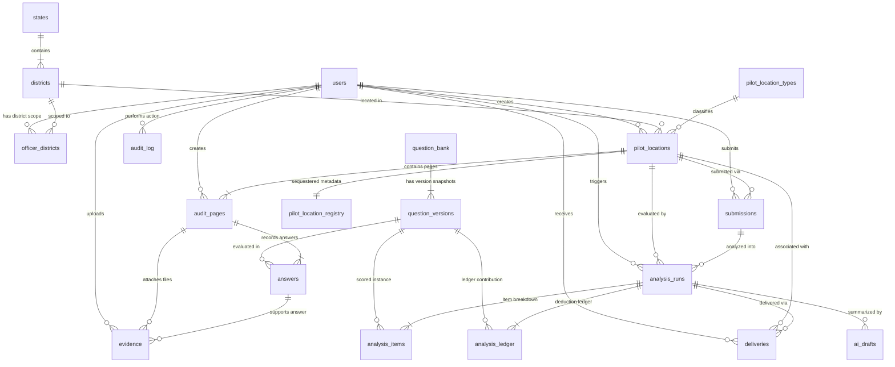

# Data Model & Schema Specification — Abhisaran Platform

## 1. Overview

The Abhisaran database schema is designed for PostgreSQL 16/17 and managed strictly via Flyway migrations.
- Primary keys are `UUID` (or standard `BIGSERIAL` for dense reference sequences).
- JSONB columns are utilized for flexible, versioned UI question fields, rubric configurations, and audit snapshots, mapped in Spring Data JPA using `@JdbcTypeCode(SqlTypes.JSON)`.
- Foreign key constraints enforce referential integrity across all relationships.
- Restricted data (names, official registration codes) is isolated in `pilot_location_registry`.

---

## 2. Entity Relationship Diagram (Mermaid)



---

## 3. Relational Schema Specifications

### 3.1 Identity, Access & Audit

#### `users`
Represents platform administrators and government officers.
```sql
CREATE TABLE users (
    id UUID PRIMARY KEY DEFAULT gen_random_uuid(),
    login_id VARCHAR(64) NOT NULL UNIQUE,
    role VARCHAR(20) NOT NULL CHECK (role IN ('ADMIN', 'OFFICER')),
    display_name VARCHAR(128) NOT NULL,
    designation VARCHAR(128),
    password_hash VARCHAR(255) NOT NULL,
    must_change_password BOOLEAN NOT NULL DEFAULT FALSE,
    active BOOLEAN NOT NULL DEFAULT TRUE,
    created_at TIMESTAMPTZ NOT NULL DEFAULT NOW(),
    updated_at TIMESTAMPTZ NOT NULL DEFAULT NOW()
);
CREATE INDEX idx_users_login_id ON users(login_id);
```

#### `login_attempts`
Tracks brute-force and lockout telemetry per IP and login identifier.
```sql
CREATE TABLE login_attempts (
    id BIGSERIAL PRIMARY KEY,
    login_id VARCHAR(64) NOT NULL,
    ip_address VARCHAR(45) NOT NULL,
    success BOOLEAN NOT NULL,
    attempted_at TIMESTAMPTZ NOT NULL DEFAULT NOW()
);
CREATE INDEX idx_login_attempts_window ON login_attempts(login_id, ip_address, attempted_at);
```

#### `audit_log`
Append-only log recording security events, data mutations, and access to restricted registries.
```sql
CREATE TABLE audit_log (
    id BIGSERIAL PRIMARY KEY,
    actor_id UUID REFERENCES users(id),
    actor_role VARCHAR(20) NOT NULL,
    action VARCHAR(64) NOT NULL,
    object_type VARCHAR(64) NOT NULL,
    object_id VARCHAR(64) NOT NULL,
    before_state JSONB,
    after_state JSONB,
    reason TEXT,
    ip_address VARCHAR(45) NOT NULL,
    created_at TIMESTAMPTZ NOT NULL DEFAULT NOW()
);
CREATE INDEX idx_audit_log_lookup ON audit_log(object_type, object_id, created_at);
```

---

### 3.2 Geography & Pilot Location Hierarchy

#### `states` & `districts`
Seeded from official Local Government Directory (LGD) reference sets.
```sql
CREATE TABLE states (
    id SERIAL PRIMARY KEY,
    code2 VARCHAR(2) NOT NULL UNIQUE,       -- e.g. 'JH', 'WB'
    name VARCHAR(128) NOT NULL,
    active BOOLEAN NOT NULL DEFAULT TRUE
);

CREATE TABLE districts (
    id SERIAL PRIMARY KEY,
    state_id INT NOT NULL REFERENCES states(id),
    code3 VARCHAR(3) NOT NULL,              -- e.g. 'RAN', 'DHN'
    name VARCHAR(128) NOT NULL,
    active BOOLEAN NOT NULL DEFAULT TRUE,
    CONSTRAINT uq_state_district_code UNIQUE(state_id, code3)
);
CREATE INDEX idx_districts_state ON districts(state_id);
```

#### `officer_districts`
Maps multi-district governance jurisdiction to Government Officers.
```sql
CREATE TABLE officer_districts (
    id SERIAL PRIMARY KEY,
    officer_id UUID NOT NULL REFERENCES users(id) ON DELETE CASCADE,
    district_id INT NOT NULL REFERENCES districts(id) ON DELETE RESTRICT,
    granted_at TIMESTAMPTZ NOT NULL DEFAULT NOW(),
    granted_by UUID REFERENCES users(id),
    CONSTRAINT uq_officer_district UNIQUE(officer_id, district_id)
);
CREATE INDEX idx_officer_districts_officer ON officer_districts(officer_id);
CREATE INDEX idx_officer_districts_district ON officer_districts(district_id);
```

#### `pilot_location_types`
Facility classifications mapping to domain audit questions.
```sql
CREATE TABLE pilot_location_types (
    id SERIAL PRIMARY KEY,
    code VARCHAR(16) NOT NULL UNIQUE,       -- 'SCHOOL', 'ANGANWADI', 'PHC', 'HOSPITAL', 'OTHER'
    prefix VARCHAR(4) NOT NULL UNIQUE,     -- 'SCH', 'AWC', 'PHC', 'HOS', 'OTH'
    label VARCHAR(64) NOT NULL,
    domain VARCHAR(32) NOT NULL            -- 'SCHOOL', 'ANGANWADI', 'HEALTH', 'GENERAL'
);
```

#### `pilot_locations` & `pilot_location_registry`
Separates public anonymized location identities from restricted identifiers.
```sql
CREATE TABLE pilot_locations (
    id UUID PRIMARY KEY DEFAULT gen_random_uuid(),
    code VARCHAR(32) NOT NULL UNIQUE,       -- e.g. 'SCH-JH-RAN-0007'
    type_id INT NOT NULL REFERENCES pilot_location_types(id),
    district_id INT NOT NULL REFERENCES districts(id),
    status VARCHAR(32) NOT NULL DEFAULT 'REGISTERED'
        CHECK (status IN ('REGISTERED', 'DRAFT', 'READY_FOR_ANALYSIS', 'ANALYSED', 'REOPENED')),
    is_demo BOOLEAN NOT NULL DEFAULT FALSE,
    created_by UUID REFERENCES users(id),
    created_at TIMESTAMPTZ NOT NULL DEFAULT NOW(),
    updated_at TIMESTAMPTZ NOT NULL DEFAULT NOW()
);
CREATE INDEX idx_pilot_locations_district ON pilot_locations(district_id);
CREATE INDEX idx_pilot_locations_status ON pilot_locations(status);

-- Restricted table: sequestered facility names and official external IDs
CREATE TABLE pilot_location_registry (
    location_id UUID PRIMARY KEY REFERENCES pilot_locations(id) ON DELETE CASCADE,
    name VARCHAR(255),
    official_code VARCHAR(64),              -- UDISE+ / POSHAN Tracker ID
    updated_at TIMESTAMPTZ NOT NULL DEFAULT NOW()
);
```

---

### 3.3 Question Bank & Versioning

#### `question_bank` & `question_versions`
Enforces immutable version snapshotting so edits never alter historical or submitted audits.
```sql
CREATE TABLE question_bank (
    id VARCHAR(16) PRIMARY KEY,             -- e.g. 'S01', 'A05', 'P02'
    domain VARCHAR(32) NOT NULL,            -- 'SCHOOL', 'ANGANWADI', 'HEALTH', 'ALL'
    section VARCHAR(32) NOT NULL,           -- 'COMMUNITY_PROFILE', 'SCHOOL', 'COMMUNITY_INTERACTION', etc.
    canonical_text TEXT NOT NULL,
    severity VARCHAR(16) NOT NULL CHECK (severity IN ('CRITICAL', 'HIGH', 'MEDIUM')),
    scored_default BOOLEAN NOT NULL DEFAULT FALSE,
    rubric_type_default VARCHAR(32) NOT NULL,
    evidence_enabled_default BOOLEAN NOT NULL DEFAULT FALSE,
    evidence_hint TEXT,
    red_flag_logic TEXT,
    suggested_intervention TEXT,
    active BOOLEAN NOT NULL DEFAULT TRUE,
    created_at TIMESTAMPTZ NOT NULL DEFAULT NOW()
);

CREATE TABLE question_versions (
    id UUID PRIMARY KEY DEFAULT gen_random_uuid(),
    question_id VARCHAR(16) NOT NULL REFERENCES question_bank(id),
    version_number INT NOT NULL,
    text TEXT NOT NULL,
    hint TEXT,
    fields_schema JSONB NOT NULL,           -- JSON specification of UI fields
    rubric_config JSONB NOT NULL,           -- JSON rules for scoring evaluation
    severity VARCHAR(16) NOT NULL,
    evidence_enabled BOOLEAN NOT NULL DEFAULT FALSE,
    evidence_hint TEXT,
    alert_overrides JSONB,
    status VARCHAR(32) NOT NULL DEFAULT 'ACTIVE'
        CHECK (status IN ('ACTIVE', 'DEFAULT_PENDING_OWNER_REVIEW', 'ARCHIVED')),
    created_by UUID REFERENCES users(id),
    created_at TIMESTAMPTZ NOT NULL DEFAULT NOW(),
    CONSTRAINT uq_question_version UNIQUE(question_id, version_number)
);
CREATE INDEX idx_qv_question ON question_versions(question_id);
```

---

### 3.4 Audit Workspace, Answers & Evidence

#### `audit_pages`
Represents an individual pass/page of the field audit form for a pilot location.
```sql
CREATE TABLE audit_pages (
    id UUID PRIMARY KEY DEFAULT gen_random_uuid(),
    location_id UUID NOT NULL REFERENCES pilot_locations(id) ON DELETE CASCADE,
    page_number INT NOT NULL,
    status VARCHAR(20) NOT NULL DEFAULT 'DRAFT' CHECK (status IN ('DRAFT', 'SUBMITTED')),
    question_version_ids JSONB NOT NULL,    -- Array of question_version UUIDs snapshotted
    created_by UUID REFERENCES users(id),
    created_at TIMESTAMPTZ NOT NULL DEFAULT NOW(),
    updated_at TIMESTAMPTZ NOT NULL DEFAULT NOW(),
    CONSTRAINT uq_location_page UNIQUE(location_id, page_number)
);
CREATE INDEX idx_audit_pages_location ON audit_pages(location_id);
```

#### `answers`
Stores responses recorded against question versions.
```sql
CREATE TABLE answers (
    id UUID PRIMARY KEY DEFAULT gen_random_uuid(),
    page_id UUID NOT NULL REFERENCES audit_pages(id) ON DELETE CASCADE,
    question_version_id UUID NOT NULL REFERENCES question_versions(id),
    value JSONB,                            -- Structured response payload
    is_na BOOLEAN NOT NULL DEFAULT FALSE,
    na_reason TEXT,
    is_not_assessed BOOLEAN NOT NULL DEFAULT FALSE,
    not_assessed_reason TEXT,
    created_at TIMESTAMPTZ NOT NULL DEFAULT NOW(),
    updated_at TIMESTAMPTZ NOT NULL DEFAULT NOW(),
    CONSTRAINT uq_page_question_answer UNIQUE(page_id, question_version_id)
);
CREATE INDEX idx_answers_page ON answers(page_id);
```

#### `evidence`
Records sanitized uploaded attachments supporting field answers.
```sql
CREATE TABLE evidence (
    id UUID PRIMARY KEY DEFAULT gen_random_uuid(),
    page_id UUID NOT NULL REFERENCES audit_pages(id) ON DELETE CASCADE,
    question_version_id UUID NOT NULL REFERENCES question_versions(id),
    answer_id UUID REFERENCES answers(id) ON DELETE SET NULL,
    storage_key VARCHAR(255) NOT NULL UNIQUE,
    mime_type VARCHAR(64) NOT NULL,
    file_size_bytes BIGINT NOT NULL,
    original_hash VARCHAR(64) NOT NULL,
    uploaded_by UUID REFERENCES users(id),
    uploaded_at TIMESTAMPTZ NOT NULL DEFAULT NOW()
);
CREATE INDEX idx_evidence_page_question ON evidence(page_id, question_version_id);
```

---

### 3.5 Submissions, Scoring & Analysis Ledger

#### `submissions`
Locks all pages of a location together for analysis.
```sql
CREATE TABLE submissions (
    id UUID PRIMARY KEY DEFAULT gen_random_uuid(),
    location_id UUID NOT NULL REFERENCES pilot_locations(id),
    submitted_by UUID NOT NULL REFERENCES users(id),
    submitted_at TIMESTAMPTZ NOT NULL DEFAULT NOW(),
    page_ids JSONB NOT NULL,
    question_version_ids JSONB NOT NULL
);
```

#### `analysis_runs`
Immutable record of an evaluated ACS analysis run.
```sql
CREATE TABLE analysis_runs (
    id UUID PRIMARY KEY DEFAULT gen_random_uuid(),
    location_id UUID NOT NULL REFERENCES pilot_locations(id),
    submission_id UUID NOT NULL REFERENCES submissions(id),
    engine_version VARCHAR(16) NOT NULL,
    acs_exact NUMERIC(5, 2) NOT NULL,       -- Stored to exact 2 decimals (e.g. 84.62)
    acs_rounded INT NOT NULL,               -- Headline round-half-up (e.g. 85)
    alert_band VARCHAR(20) NOT NULL CHECK (alert_band IN ('RED', 'ORANGE', 'AMBER', 'LIGHT_GREEN', 'DARK_GREEN')),
    coverage_pct NUMERIC(5, 2) NOT NULL,
    is_provisional BOOLEAN NOT NULL DEFAULT FALSE,
    pooled_pages_count INT NOT NULL,
    per_page_scores JSONB NOT NULL,
    per_section_scores JSONB NOT NULL,
    created_by UUID REFERENCES users(id),
    created_at TIMESTAMPTZ NOT NULL DEFAULT NOW()
);
CREATE INDEX idx_analysis_runs_location ON analysis_runs(location_id, created_at DESC);
```

#### `analysis_items` & `analysis_ledger`
Itemized question scoring working and mathematically balanced deduction ledger.
```sql
CREATE TABLE analysis_items (
    id BIGSERIAL PRIMARY KEY,
    run_id UUID NOT NULL REFERENCES analysis_runs(id) ON DELETE CASCADE,
    question_version_id UUID NOT NULL REFERENCES question_versions(id),
    page_number INT NOT NULL,
    raw_earned NUMERIC(6, 2) NOT NULL,
    raw_max NUMERIC(6, 2) NOT NULL,
    severity_weight INT NOT NULL,
    earned_w NUMERIC(8, 2) NOT NULL,
    max_w NUMERIC(8, 2) NOT NULL,
    alert_band VARCHAR(20) NOT NULL,
    alert_message TEXT NOT NULL,
    suggested_action TEXT,
    evidence_ids JSONB
);

CREATE TABLE analysis_ledger (
    id BIGSERIAL PRIMARY KEY,
    run_id UUID NOT NULL REFERENCES analysis_runs(id) ON DELETE CASCADE,
    question_version_id UUID NOT NULL REFERENCES question_versions(id),
    page_number INT NOT NULL,
    raw_earned NUMERIC(6, 2) NOT NULL,
    raw_max NUMERIC(6, 2) NOT NULL,
    lost_w NUMERIC(8, 2) NOT NULL,
    points_lost_acs NUMERIC(5, 2) NOT NULL, -- Contribution to (100 - ACS)
    rubric_rule_text TEXT NOT NULL,
    evidence_count INT NOT NULL DEFAULT 0
);
CREATE INDEX idx_analysis_ledger_run ON analysis_ledger(run_id);
```

#### `deliveries`
Automatically notifies and provides unread indicators to officers within district scope.
```sql
CREATE TABLE deliveries (
    id UUID PRIMARY KEY DEFAULT gen_random_uuid(),
    officer_id UUID NOT NULL REFERENCES users(id) ON DELETE CASCADE,
    run_id UUID NOT NULL REFERENCES analysis_runs(id) ON DELETE CASCADE,
    location_id UUID NOT NULL REFERENCES pilot_locations(id) ON DELETE CASCADE,
    delivered_at TIMESTAMPTZ NOT NULL DEFAULT NOW(),
    read_at TIMESTAMPTZ,
    CONSTRAINT uq_officer_run_delivery UNIQUE(officer_id, run_id)
);
CREATE INDEX idx_deliveries_officer_read ON deliveries(officer_id, read_at);
```

---

### 3.6 Assistive AI Drafts

#### `ai_drafts`
Segregated table storing human-assistive AI outputs. AI has no direct DB access.
```sql
CREATE TABLE ai_drafts (
    id UUID PRIMARY KEY DEFAULT gen_random_uuid(),
    target_type VARCHAR(32) NOT NULL,       -- 'ANALYSIS_RUN', 'EVIDENCE_OCR', 'OBSERVATIONS'
    target_id UUID NOT NULL,
    service_id VARCHAR(64) NOT NULL,
    input_refs JSONB NOT NULL,              -- IDs only, never names or raw text
    output_text TEXT NOT NULL,
    quality_metadata JSONB,
    status VARCHAR(20) NOT NULL DEFAULT 'DRAFT' CHECK (status IN ('DRAFT', 'ACCEPTED', 'REJECTED')),
    accepted_by UUID REFERENCES users(id),
    accepted_at TIMESTAMPTZ,
    created_at TIMESTAMPTZ NOT NULL DEFAULT NOW()
);
CREATE INDEX idx_ai_drafts_target ON ai_drafts(target_type, target_id);
```
